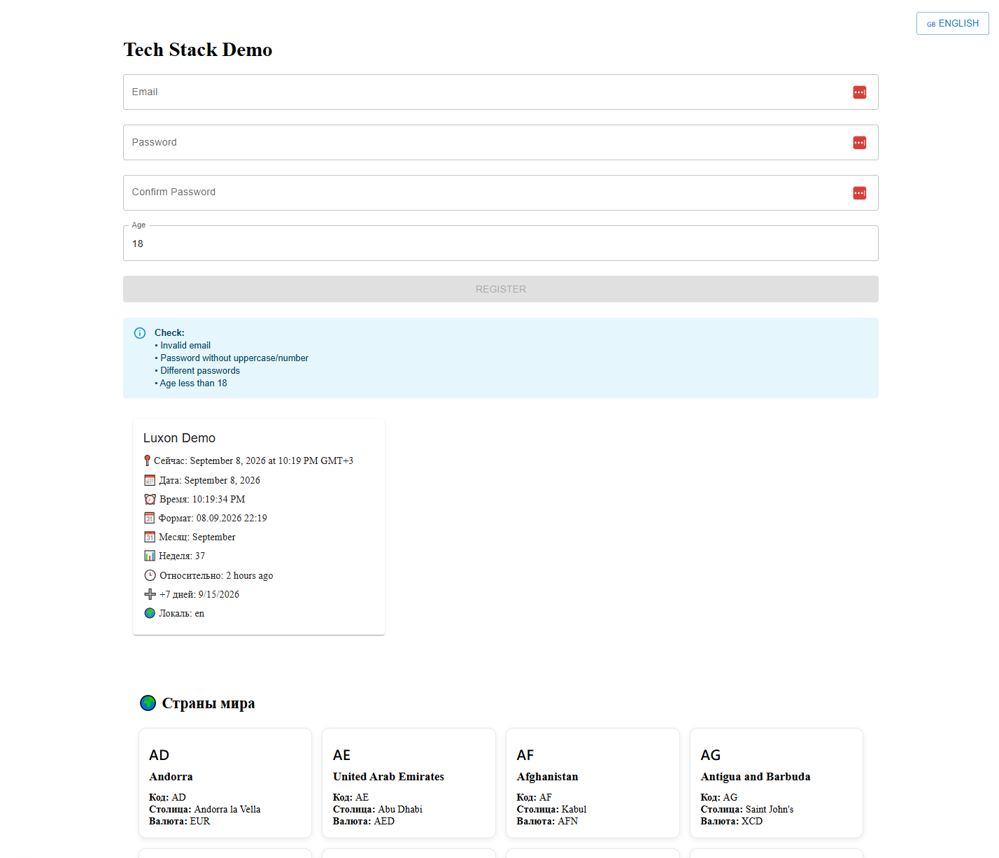

# 🚀 Frontend Monorepo Playground

Монорепозиторий для изучения и демонстрации современных frontend-технологий и архитектурных подходов.
## Скриншот



## Что реализовано

- ⚡ Next.js (App Router)
- 🔷 TypeScript
- 🏗️ Monorepo (Turborepo + Lerna)
- 🎨 Material UI
- 🌍 Локализация (next-intl)
- 📡 Apollo Client + GraphQL
- 📝 React Hook Form
- ✅ Валидация через Zod
- 🕒 Работа с датами через Luxon
- 📚 Storybook
- 🧪 Vitest
- 🔌 SignalR
- 🐳 Docker

---

## Архитектура проекта

```text
frontend-monorepo-playground
│
├── packages
│   ├── demo       # Next.js приложение
│   └── ui         # UI-библиотека компонентов
│
├── Dockerfile
├── docker-compose.yml
├── turbo.json
├── lerna.json
└── package.json
```

---

## Технологии

| Категория | Технологии |
|------------|------------|
| Framework | Next.js |
| Язык | TypeScript |
| UI | Material UI |
| Формы | React Hook Form |
| Валидация | Zod |
| API | GraphQL |
| Клиент API | Apollo Client |
| Локализация | next-intl |
| Работа с датами | Luxon |
| Realtime | SignalR |
| Документация компонентов | Storybook |
| Тестирование | Vitest |
| Контейнеризация | Docker |
| Монорепозиторий | Turborepo, Lerna |

---

## Демонстрационные модули

### 🌍 Интернационализация

Реализовано переключение языков через `next-intl`.

Поддерживаемые локали:

- Русский
- Английский

---

### 📝 Форма регистрации

Форма построена на базе:

- React Hook Form
- Zod

Покрывает:

- проверку email;
- проверку возраста;
- проверку сложности пароля;
- подтверждение пароля.

---

### 📡 GraphQL

Настроен Apollo Client.

Пример использования:

- GraphQL Query
- Loading State
- Error Handling
- TypeScript типизация

---

### 🕒 Luxon

Примеры работы с датами:

- локализация;
- форматирование;
- относительное время;
- арифметика дат.

---

### 🎨 UI Library

В пакете `packages/ui` размещаются переиспользуемые компоненты.

Цель:

- отделить UI от приложения;
- создать основу для дизайн-системы;
- использовать компоненты между приложениями монорепозитория.

---

### 📚 Storybook

Для UI-компонентов настроен Storybook.

Позволяет:

- разрабатывать компоненты изолированно;
- документировать состояния компонентов;
- тестировать UI независимо от приложения.

---

## Запуск проекта

Установка зависимостей:

```bash
npm install
```

Запуск разработки:

```bash
npm run dev
```

Сборка:

```bash
npm run build
```

Очистка артефактов:

```bash
npm run clean
```

---

## Storybook

Запуск Storybook:

```bash
npm run storybook
```

---

## Docker

Запуск проекта в контейнере:

```bash
docker-compose up --build
```

---

## Цель проекта

Проект используется для изучения и практики:

- архитектуры монорепозиториев;
- Next.js App Router;
- GraphQL;
- локализации;
- переиспользуемых UI-компонентов;
- Storybook;
- современных frontend-подходов.

---

